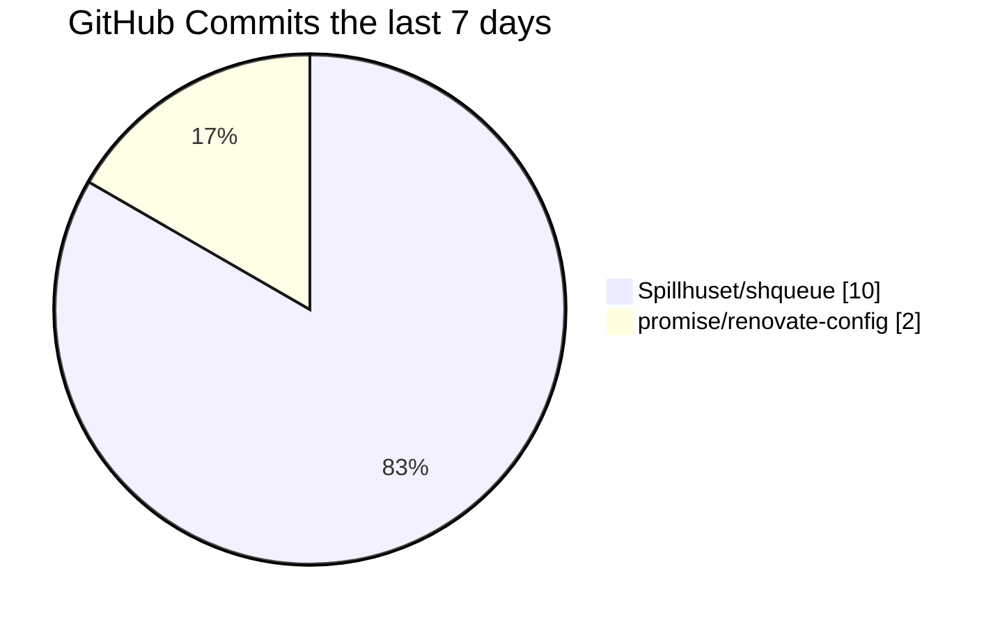

[](https://discord.com/users/110090225929191424)
[](https://discord.com/users/110090225929191424)
[](https://discord.com/users/110090225929191424)
[](https://api.statusbadges.me/openspotify/110090225929191424)
[](https://promise.solutions/discord)

# 👋 I'm Glenn

a `19.7449`-year old Node developer cruising through life with a terrible music taste, horrendous posture and probably in front of some sort of computer screen.

<p align="center">
  <picture>
    <source media="(prefers-color-scheme: dark)" srcset="https://skillicons.dev/icons?i=ts%2Cnodejs%2Cjs%2Cdiscord%2Cbots%2Cexpress%2Cdocker%2Cgithub%2Cgithubactions%2Cmongodb%2Cvscode%2Ccloudflare%2Cworkers%2Ctailwind%2Cjest%2Creact%2Cgit%2Cmd%2Cregex%2Clinux%2Cnginx%2Chtml%2Ccss&perline=17&theme=dark">
    <source media="(prefers-color-scheme: light)" srcset="https://skillicons.dev/icons?i=ts%2Cnodejs%2Cjs%2Cdiscord%2Cbots%2Cexpress%2Cdocker%2Cgithub%2Cgithubactions%2Cmongodb%2Cvscode%2Ccloudflare%2Cworkers%2Ctailwind%2Cjest%2Creact%2Cgit%2Cmd%2Cregex%2Clinux%2Cnginx%2Chtml%2Ccss&perline=17&theme=light">
    
  </picture>
</p>

## Recent GitHub Activity



<details>
  <summary>My most recent activity on GitHub</summary>

```
✨ Pushed 1 commit to Spillhuset/shqueue
✨ Pushed 2 commits to Spillhuset/shqueue
✨ Pushed 1 commit to promise/renovate-config
✨ Pushed 1 commit to Spillhuset/shqueue
✨ Pushed 1 commit to Spillhuset/shqueue
✅ Merged PR #22 in Spillhuset/shqueue
✨ Pushed 1 commit to Spillhuset/shqueue
✨ Pushed 2 commits to Spillhuset/shqueue
✨ Pushed 1 commit to promise/renovate-config
✨ Pushed 1 commit to Spillhuset/shqueue
✨ Pushed 1 commit to Spillhuset/shqueue
✅ Merged PR #22 in Spillhuset/shqueue
✨ Pushed 1 commit to countr/countr
✅ Merged PR #1022 in countr/countr
✨ Pushed 1 commit to countr/countr
✅ Merged PR #1006 in countr/countr
✅ Merged PR #1009 in countr/countr
✨ Pushed 1 commit to countr/countr
✨ Pushed 2 commits to countr/countr
📝 Created review (approved) on PR #1022 in countr/countr
✅ Merged PR #1010 in countr/countr
✨ Pushed 1 commit to countr/countr
❓ Closed issue #1019 in countr/countr
✨ Pushed 1 commit to countr/countr
✅ Merged PR #1020 in countr/countr
📝 Created review (approved) on PR #1020 in countr/countr
✨ Pushed 1 commit to Spillhuset/shqueue
❓ Closed issue #17 in Spillhuset/shqueue
✨ Pushed 2 commits to Spillhuset/shqueue
❓ Opened issue #17 in Spillhuset/shqueue
🎨 Created Spillhuset/shinfo
✨ Pushed 1 commit to Spillhuset/django-system-template
✨ Pushed 1 commit to Spillhuset/shqueue
✅ Merged PR #13 in Spillhuset/shqueue
❌ Closed PR #9 in Spillhuset/shqueue
✨ Pushed 1 commit to Spillhuset/shqueue
✨ Pushed 3 commits to Spillhuset/django-system-template
✨ Pushed 2 commits to Spillhuset/shauth
✨ Pushed 1 commit to Spillhuset/shqueue
✨ Pushed 2 commits to Spillhuset/django-system-template
✨ Pushed 1 commit to promise/renovate-config
✨ Pushed 1 commit to Spillhuset/django-system-template
✅ Merged PR #4 in Spillhuset/django-system-template
✨ Pushed 1 commit to Spillhuset/django-system-template
✅ Merged PR #2 in Spillhuset/django-system-template
✅ Merged PR #7 in Spillhuset/shqueue
✨ Pushed 1 commit to Spillhuset/shqueue
✨ Pushed 1 commit to Spillhuset/django-system-template
✅ Merged PR #5 in Spillhuset/django-system-template
✨ Pushed 1 commit to Spillhuset/django-system-template
✅ Merged PR #3 in Spillhuset/django-system-template
✨ Pushed 1 commit to Spillhuset/shqueue
✅ Merged PR #1 in Spillhuset/shqueue
✨ Pushed 1 commit to Spillhuset/django-system-template
✨ Pushed 1 commit to Spillhuset/shqueue
✅ Merged PR #5 in Spillhuset/shqueue
✨ Pushed 1 commit to Spillhuset/shqueue
✅ Merged PR #2 in Spillhuset/shqueue
✅ Merged PR #3 in Spillhuset/shqueue
✨ Pushed 1 commit to Spillhuset/shqueue
✨ Pushed 1 commit to Spillhuset/shqueue
✨ Pushed 1 commit to Spillhuset/shqueue
🎨 Created Spillhuset/shqueue
✨ Pushed 1 commit to Spillhuset/django-system-template
✅ Merged PR #1 in Spillhuset/django-system-template
✨ Pushed 1 commit to Spillhuset/django-system-template
✨ Pushed 1 commit to Spillhuset/django-system-template
💪 Opened PR #1 in Spillhuset/django-system-template
✨ Pushed 4 commits to Spillhuset/django-system-template
```
</details>

## FAQ

### You have unsigned commits, why?

I am using [vigilant mode](https://docs.github.com/github/authenticating-to-github/displaying-verification-statuses-for-all-of-your-commits) on GitHub, starting from November 1st 2021. Any commits before this that is "unverified" is still me, but I will try and verify each commit going forward.

### What coding style do you use?

I try to have a consistent coding style when I code, so I made this linting config: https://github.com/promise/eslint-config - This is *my* style and everyone has their own style, but feel free to use this as a template to find your own style.

### What config do you use for Renovate?

I have my own mutual config repository I use everywhere here: https://github.com/promise/renovate-config - If you plan on using it yourself then I suggest you fork it as I might update stuff on-the-go as I please.

### Could you help me with my code?

**TL;DR: Maybe.** You can join my [Discord](https://promise.solutions/discord) and go to the #coding channel (below #general), there's plenty of developers in the server and they all having different experiences with different languages and packages. We can, of course, not guarantee you'll get your answer, but we don't bite so give it a shot ;)

> Thanks for checking out my profile. [](https://github.com/promise/readme/actions/workflows/run.yml) 
