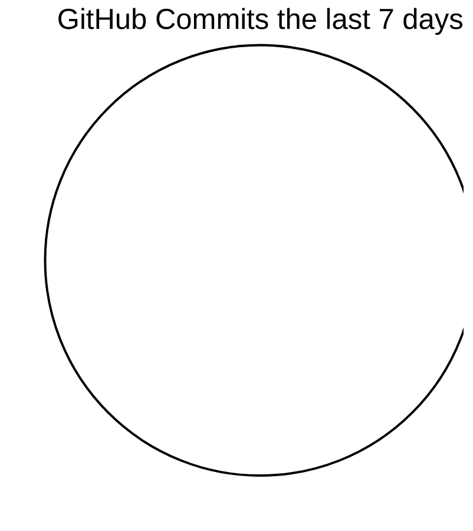

[](https://discord.com/users/110090225929191424)
[](https://discord.com/users/110090225929191424)
[](https://discord.com/users/110090225929191424)
[](https://api.statusbadges.me/openspotify/110090225929191424)
[](https://promise.solutions/discord)

# 👋 I'm Glenn

a `20.726`-year old Node developer cruising through life with a terrible music taste, horrendous posture and probably in front of some sort of computer screen.

<p align="center">
  <picture>
    <source media="(prefers-color-scheme: dark)" srcset="https://skillicons.dev/icons?i=ts%2Cnodejs%2Cjs%2Cdiscord%2Cbots%2Cexpress%2Cdocker%2Cgithub%2Cgithubactions%2Cmongodb%2Cvscode%2Ccloudflare%2Cworkers%2Ctailwind%2Cjest%2Creact%2Cgit%2Cmd%2Cregex%2Clinux%2Cnginx%2Chtml%2Ccss&perline=17&theme=dark">
    <source media="(prefers-color-scheme: light)" srcset="https://skillicons.dev/icons?i=ts%2Cnodejs%2Cjs%2Cdiscord%2Cbots%2Cexpress%2Cdocker%2Cgithub%2Cgithubactions%2Cmongodb%2Cvscode%2Ccloudflare%2Cworkers%2Ctailwind%2Cjest%2Creact%2Cgit%2Cmd%2Cregex%2Clinux%2Cnginx%2Chtml%2Ccss&perline=17&theme=light">
    
  </picture>
</p>

## Recent GitHub Activity



<details>
  <summary>My most recent activity on GitHub</summary>

```
📝 Created review (approved) on PR #8 in advaith1/statusbadges
🗣 Commented on #7 in advaith1/statusbadges
📝 Created review (changes_requested) on PR #6 in advaith1/statusbadges
✨ Pushed 1 commit to countr/status-page-cronjob
✨ Pushed 1 commit to countr/status-page-cronjob
✅ Merged PR #208 in Spillhuset/shinfo
✨ Pushed 1 commit to Spillhuset/shinfo
✅ Merged PR #154 in Spillhuset/shinfo
✨ Pushed 1 commit to Spillhuset/shinfo
✨ Pushed 1 commit to Spillhuset/shqueue
✅ Merged PR #214 in Spillhuset/shqueue
✨ Pushed 1 commit to Spillhuset/shinfo
✅ Merged PR #176 in Spillhuset/shinfo
✨ Pushed 1 commit to Spillhuset/shqueue
✅ Merged PR #231 in Spillhuset/shqueue
✨ Pushed 1 commit to Spillhuset/shinfo
📝 Created review (approved) on PR #8 in advaith1/statusbadges
🗣 Commented on #7 in advaith1/statusbadges
📝 Created review (changes_requested) on PR #6 in advaith1/statusbadges
✨ Pushed 1 commit to countr/status-page-cronjob
✨ Pushed 1 commit to countr/status-page-cronjob
✅ Merged PR #208 in Spillhuset/shinfo
✨ Pushed 1 commit to Spillhuset/shinfo
✅ Merged PR #154 in Spillhuset/shinfo
✨ Pushed 1 commit to Spillhuset/shinfo
✨ Pushed 1 commit to Spillhuset/shqueue
✅ Merged PR #214 in Spillhuset/shqueue
✨ Pushed 1 commit to Spillhuset/shinfo
✅ Merged PR #176 in Spillhuset/shinfo
✨ Pushed 1 commit to Spillhuset/shqueue
✅ Merged PR #231 in Spillhuset/shqueue
✨ Pushed 1 commit to Spillhuset/shinfo
✅ Merged PR #175 in Spillhuset/shinfo
✨ Pushed 1 commit to Spillhuset/shqueue
✅ Merged PR #238 in Spillhuset/shqueue
✅ Merged PR #171 in Spillhuset/shinfo
✨ Pushed 1 commit to Spillhuset/shinfo
✨ Pushed 1 commit to Spillhuset/shqueue
✅ Merged PR #258 in Spillhuset/shqueue
✨ Pushed 1 commit to Spillhuset/shinfo
✅ Merged PR #196 in Spillhuset/shinfo
✨ Pushed 1 commit to Spillhuset/shqueue
✅ Merged PR #239 in Spillhuset/shqueue
✨ Pushed 1 commit to Spillhuset/shqueue
✅ Merged PR #213 in Spillhuset/shqueue
✨ Pushed 1 commit to Spillhuset/django-system-template
✅ Merged PR #203 in Spillhuset/django-system-template
✨ Pushed 1 commit to Spillhuset/shinfo
✅ Merged PR #201 in Spillhuset/shinfo
✨ Pushed 1 commit to Spillhuset/shqueue
✅ Merged PR #262 in Spillhuset/shqueue
✨ Pushed 1 commit to promise/discord-bot-boilerplate
✅ Merged PR #586 in promise/discord-bot-boilerplate
✨ Pushed 1 commit to Spillhuset/django-system-template
✅ Merged PR #253 in Spillhuset/django-system-template
✨ Pushed 1 commit to Spillhuset/shinfo
✅ Merged PR #153 in Spillhuset/shinfo
✨ Pushed 1 commit to Spillhuset/shqueue
✅ Merged PR #270 in Spillhuset/shqueue
✨ Pushed 1 commit to project-blurple/blurple-contests
✅ Merged PR #770 in project-blurple/blurple-contests
✨ Pushed 1 commit to Spillhuset/shinfo
✅ Merged PR #229 in Spillhuset/shinfo
✨ Pushed 1 commit to project-blurple/blurple-hammer
✅ Merged PR #800 in project-blurple/blurple-hammer
✨ Pushed 1 commit to countr/countr
✅ Merged PR #1293 in countr/countr
✨ Pushed 1 commit to Spillhuset/django-system-template
✅ Merged PR #261 in Spillhuset/django-system-template
✨ Pushed 1 commit to Spillhuset/django-system-template
✅ Merged PR #249 in Spillhuset/django-system-template
✨ Pushed 1 commit to Spillhuset/django-system-template
✅ Merged PR #227 in Spillhuset/django-system-template
✨ Pushed 1 commit to biaw/test-area
✅ Merged PR #757 in biaw/test-area
✨ Pushed 1 commit to biaw/test-area
✅ Merged PR #782 in biaw/test-area
❌ Closed PR #266 in Spillhuset/shqueue
❌ Closed PR #204 in Spillhuset/shinfo
✨ Pushed 1 commit to Spillhuset/shinfo
✨ Pushed 1 commit to countr/countr
✅ Merged PR #1266 in countr/countr
✅ Merged PR #774 in project-blurple/blurple-hammer
✨ Pushed 1 commit to project-blurple/blurple-hammer
✨ Pushed 1 commit to countr/countr
✅ Merged PR #1275 in countr/countr
✨ Pushed 1 commit to project-blurple/blurple-hammer
✅ Merged PR #829 in project-blurple/blurple-hammer
✨ Pushed 1 commit to project-blurple/blurple-contests
✅ Merged PR #771 in project-blurple/blurple-contests
✨ Pushed 1 commit to Spillhuset/django-system-template
✨ Pushed 1 commit to countr/countr
✅ Merged PR #1294 in countr/countr
✨ Pushed 1 commit to project-blurple/blurple-hammer
✅ Merged PR #801 in project-blurple/blurple-hammer
✨ Pushed 1 commit to project-blurple/blurple-contests
✅ Merged PR #745 in project-blurple/blurple-contests
✨ Pushed 1 commit to biaw/file-download-network
✅ Merged PR #143 in biaw/file-download-network
✨ Pushed 1 commit to Spillhuset/shinfo
✅ Merged PR #222 in biaw/file-download-network
✨ Pushed 1 commit to biaw/file-download-network
✨ Pushed 1 commit to biaw/file-download-network
✅ Merged PR #221 in biaw/file-download-network
✨ Pushed 1 commit to countr/countr
✅ Merged PR #1311 in countr/countr
✨ Pushed 1 commit to project-blurple/blurple-hammer
✅ Merged PR #828 in project-blurple/blurple-hammer
✨ Pushed 0 commit to Spillhuset/shqueue
✨ Pushed 1 commit to promise/discord-bot-boilerplate
✅ Merged PR #570 in promise/discord-bot-boilerplate
✨ Pushed 1 commit to Spillhuset/shqueue
✨ Pushed 1 commit to biaw/file-download-network
✅ Merged PR #156 in biaw/file-download-network
✨ Pushed 1 commit to promise/discord-bot-boilerplate
✅ Merged PR #587 in promise/discord-bot-boilerplate
✨ Pushed 1 commit to Spillhuset/django-system-template
✅ Merged PR #220 in Spillhuset/django-system-template
✨ Pushed 1 commit to project-blurple/blurple-contests
✅ Merged PR #751 in project-blurple/blurple-contests
✨ Pushed 1 commit to promise/discord-bot-boilerplate
✅ Merged PR #572 in promise/discord-bot-boilerplate
✨ Pushed 1 commit to countr/countr
✅ Merged PR #1321 in countr/countr
✨ Pushed 1 commit to biaw/file-download-network
✅ Merged PR #225 in biaw/file-download-network
✨ Pushed 1 commit to Spillhuset/django-system-template
✅ Merged PR #204 in Spillhuset/django-system-template
✨ Pushed 1 commit to project-blurple/blurple-hammer
✅ Merged PR #833 in project-blurple/blurple-hammer
✨ Pushed 1 commit to Spillhuset/django-system-template
✅ Merged PR #228 in Spillhuset/django-system-template
✨ Pushed 1 commit to biaw/file-download-network
✅ Merged PR #192 in biaw/file-download-network
✨ Pushed 1 commit to countr/access-manager
✅ Merged PR #563 in countr/access-manager
✨ Pushed 1 commit to biaw/file-download-network
✅ Merged PR #206 in biaw/file-download-network
```
</details>

> Thanks for checking out my profile. [](https://github.com/promise/readme/actions/workflows/run.yml) 
