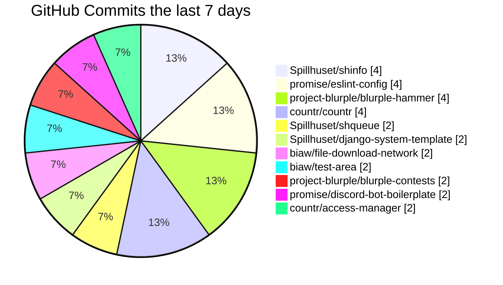

[](https://discord.com/users/110090225929191424)
[](https://discord.com/users/110090225929191424)
[](https://discord.com/users/110090225929191424)
[](https://api.statusbadges.me/openspotify/110090225929191424)
[](https://promise.solutions/discord)

# 👋 I'm Glenn

a `20.1501`-year old Node developer cruising through life with a terrible music taste, horrendous posture and probably in front of some sort of computer screen.

<p align="center">
  <picture>
    <source media="(prefers-color-scheme: dark)" srcset="https://skillicons.dev/icons?i=ts%2Cnodejs%2Cjs%2Cdiscord%2Cbots%2Cexpress%2Cdocker%2Cgithub%2Cgithubactions%2Cmongodb%2Cvscode%2Ccloudflare%2Cworkers%2Ctailwind%2Cjest%2Creact%2Cgit%2Cmd%2Cregex%2Clinux%2Cnginx%2Chtml%2Ccss&perline=17&theme=dark">
    <source media="(prefers-color-scheme: light)" srcset="https://skillicons.dev/icons?i=ts%2Cnodejs%2Cjs%2Cdiscord%2Cbots%2Cexpress%2Cdocker%2Cgithub%2Cgithubactions%2Cmongodb%2Cvscode%2Ccloudflare%2Cworkers%2Ctailwind%2Cjest%2Creact%2Cgit%2Cmd%2Cregex%2Clinux%2Cnginx%2Chtml%2Ccss&perline=17&theme=light">
    
  </picture>
</p>

## Recent GitHub Activity


```mermaid
  pie showData
    title GitHub Commits the last 7 days
    "Spillhuset/shinfo" : 4
    "promise/eslint-config" : 4
    "project-blurple/blurple-hammer" : 4
    "countr/countr" : 4
    "Spillhuset/shqueue" : 2
    "Spillhuset/django-system-template" : 2
    "biaw/file-download-network" : 2
    "biaw/test-area" : 2
    "project-blurple/blurple-contests" : 2
    "promise/discord-bot-boilerplate" : 2
    "countr/access-manager" : 2
```

<details>
  <summary>My most recent activity on GitHub</summary>

```
✨ Pushed 1 commit to Spillhuset/shinfo
✨ Pushed 1 commit to promise/eslint-config
✨ Pushed 1 commit to Spillhuset/shqueue
✅ Merged PR #146 in Spillhuset/shqueue
✨ Pushed 1 commit to Spillhuset/django-system-template
✅ Merged PR #138 in Spillhuset/django-system-template
✨ Pushed 1 commit to Spillhuset/shinfo
✅ Merged PR #84 in Spillhuset/shinfo
✨ Pushed 1 commit to project-blurple/blurple-hammer
✅ Merged PR #698 in project-blurple/blurple-hammer
✨ Pushed 1 commit to biaw/file-download-network
✅ Merged PR #62 in biaw/file-download-network
✨ Pushed 1 commit to countr/countr
✅ Merged PR #1190 in countr/countr
✨ Pushed 1 commit to promise/eslint-config
✨ Pushed 1 commit to biaw/test-area
✅ Merged PR #671 in biaw/test-area
✨ Pushed 1 commit to project-blurple/blurple-contests
✅ Merged PR #656 in project-blurple/blurple-contests
✨ Pushed 1 commit to promise/discord-bot-boilerplate
✅ Merged PR #483 in promise/discord-bot-boilerplate
✨ Pushed 1 commit to project-blurple/blurple-hammer
✅ Merged PR #677 in project-blurple/blurple-hammer
✨ Pushed 1 commit to countr/access-manager
✅ Merged PR #460 in countr/access-manager
✨ Pushed 1 commit to countr/countr
✅ Merged PR #1171 in countr/countr
✨ Pushed 1 commit to Spillhuset/shinfo
✨ Pushed 1 commit to promise/eslint-config
✨ Pushed 1 commit to Spillhuset/shqueue
✅ Merged PR #146 in Spillhuset/shqueue
✨ Pushed 1 commit to Spillhuset/django-system-template
✅ Merged PR #138 in Spillhuset/django-system-template
✨ Pushed 1 commit to Spillhuset/shinfo
✅ Merged PR #84 in Spillhuset/shinfo
✨ Pushed 1 commit to project-blurple/blurple-hammer
✅ Merged PR #698 in project-blurple/blurple-hammer
✨ Pushed 1 commit to biaw/file-download-network
✅ Merged PR #62 in biaw/file-download-network
✨ Pushed 1 commit to countr/countr
✅ Merged PR #1190 in countr/countr
✨ Pushed 1 commit to promise/eslint-config
✨ Pushed 1 commit to biaw/test-area
✅ Merged PR #671 in biaw/test-area
✨ Pushed 1 commit to project-blurple/blurple-contests
✅ Merged PR #656 in project-blurple/blurple-contests
✨ Pushed 1 commit to promise/discord-bot-boilerplate
✅ Merged PR #483 in promise/discord-bot-boilerplate
✨ Pushed 1 commit to project-blurple/blurple-hammer
✅ Merged PR #677 in project-blurple/blurple-hammer
✨ Pushed 1 commit to countr/access-manager
✅ Merged PR #460 in countr/access-manager
✨ Pushed 1 commit to countr/countr
✅ Merged PR #1171 in countr/countr
🗣 Commented on #2827 in PorticoEstate/PorticoEstate
🗣 Commented on #405 in biaw/tickets
❓ Closed issue #405 in biaw/tickets
✨ Pushed 1 commit to biaw/file-download-network
✅ Merged PR #37 in biaw/file-download-network
✨ Pushed 1 commit to project-blurple/blurple-hammer
✅ Merged PR #676 in project-blurple/blurple-hammer
✨ Pushed 1 commit to countr/countr
✅ Merged PR #1170 in countr/countr
✨ Pushed 1 commit to biaw/file-download-network
✅ Merged PR #36 in biaw/file-download-network
✨ Pushed 1 commit to promise/eslint-config
✨ Pushed 1 commit to promise/renovate-config
✨ Pushed 1 commit to project-blurple/blurple-contests
✅ Merged PR #647 in project-blurple/blurple-contests
✨ Pushed 1 commit to countr/access-manager
✅ Merged PR #453 in countr/access-manager
✨ Pushed 1 commit to project-blurple/blurple-hammer
✅ Merged PR #662 in project-blurple/blurple-hammer
✨ Pushed 1 commit to promise/discord-bot-boilerplate
✅ Merged PR #473 in promise/discord-bot-boilerplate
✨ Pushed 1 commit to countr/countr
✅ Merged PR #1160 in countr/countr
✨ Pushed 1 commit to biaw/test-area
✅ Merged PR #662 in biaw/test-area
✨ Pushed 3 commits to project-blurple/blurple-contests
✨ Pushed 1 commit to project-blurple/blurple-contests
✨ Pushed 1 commit to project-blurple/blurple-hammer
✨ Pushed 1 commit to project-blurple/blurple-hammer
✅ Merged PR #613 in project-blurple/blurple-hammer
✨ Pushed 1 commit to project-blurple/blurple-contests
✅ Merged PR #597 in project-blurple/blurple-contests
✨ Pushed 1 commit to biaw/test-area
✅ Merged PR #624 in biaw/test-area
✨ Pushed 1 commit to countr/access-manager
✅ Merged PR #427 in countr/access-manager
✨ Pushed 1 commit to promise/discord-bot-boilerplate
✅ Merged PR #427 in promise/discord-bot-boilerplate
✨ Pushed 1 commit to Spillhuset/shinfo
✅ Merged PR #26 in Spillhuset/shinfo
✨ Pushed 1 commit to countr/countr
✅ Merged PR #1150 in countr/countr
✨ Pushed 1 commit to project-blurple/blurple-hammer
✅ Merged PR #625 in project-blurple/blurple-hammer
✨ Pushed 1 commit to project-blurple/blurple-contests
✅ Merged PR #609 in project-blurple/blurple-contests
✨ Pushed 1 commit to countr/access-manager
✅ Merged PR #430 in countr/access-manager
✨ Pushed 1 commit to biaw/test-area
✅ Merged PR #631 in biaw/test-area
✨ Pushed 1 commit to promise/discord-bot-boilerplate
✅ Merged PR #436 in promise/discord-bot-boilerplate
✨ Pushed 1 commit to Spillhuset/shinfo
✅ Merged PR #30 in Spillhuset/shinfo
✨ Pushed 1 commit to biaw/phone
✨ Pushed 1 commit to Spillhuset/shqueue
✅ Merged PR #87 in Spillhuset/shqueue
✨ Pushed 1 commit to promise/discord-bot-boilerplate
✅ Merged PR #443 in promise/discord-bot-boilerplate
✨ Pushed 1 commit to countr/countr
✅ Merged PR #1114 in countr/countr
✨ Pushed 1 commit to countr/access-manager
✅ Merged PR #444 in countr/access-manager
✨ Pushed 1 commit to Spillhuset/shinfo
✅ Merged PR #19 in Spillhuset/shinfo
✨ Pushed 1 commit to project-blurple/blurple-hammer
✅ Merged PR #631 in project-blurple/blurple-hammer
✨ Pushed 1 commit to project-blurple/blurple-contests
✅ Merged PR #617 in project-blurple/blurple-contests
✨ Pushed 1 commit to biaw/test-area
✅ Merged PR #652 in biaw/test-area
✨ Pushed 1 commit to promise/discord-bot-boilerplate
✅ Merged PR #463 in promise/discord-bot-boilerplate
✨ Pushed 1 commit to Spillhuset/shqueue
✅ Merged PR #109 in Spillhuset/shqueue
✨ Pushed 1 commit to biaw/file-download-network
✨ Pushed 1 commit to Spillhuset/shinfo
✅ Merged PR #23 in Spillhuset/shinfo
✨ Pushed 1 commit to Spillhuset/django-system-template
✅ Merged PR #82 in Spillhuset/django-system-template
✨ Pushed 1 commit to countr/countr
✅ Merged PR #1125 in countr/countr
✨ Pushed 1 commit to biaw/file-download-network
✅ Merged PR #13 in biaw/file-download-network
```
</details>

> Thanks for checking out my profile. [](https://github.com/promise/readme/actions/workflows/run.yml) 
